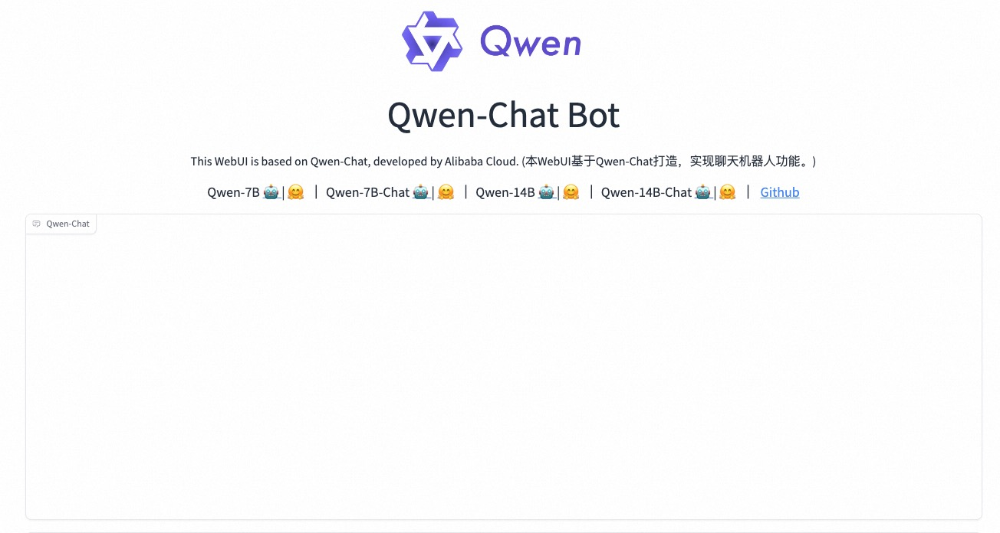

# Qwen-7B-Chat

## QuickStart

### Prerequisites

- An ASK cluster is created. For more information,
  see [Create an ASK cluster](https://www.alibabacloud.com/help/en/ack/serverless-kubernetes/user-guide/create-an-ask-cluster-2?spm=a2c63.p38356.0.0.664265cdTbNZo1#task-e3c-311-ydb)
- The cluster runs as expected. You can log on to the Container Service for Kubernetes (ACK) console, navigate to the
  Clusters page, and then check whether the cluster is in the Running state.

### Deploy Qwen-7B-Chat

1. create deployment & service

```bash
# for cpu
kubectl apply -f qwen-7b-chat-cpu.yaml
# for gpu
kubectl apply -f qwen-7b-chat-gpu.yaml
```

2. wait deployment ready

```bash
$ kubectl get po |grep qwen-7b-chat
---
NAME                                READY   STATUS              RESTARTS   AGE
qwen-7b-chat-65f7cbfbc5-gb7wd           1/1     Running             0          36s
```

3. Using qwen-chatbot

Run the following command to port-forward:

```
kubectl port-forward -n <namespace> service/qwen-7b-chat-svc 8000:8000
```

And then open the console using the following URL:

```
http://localhost:8000
```



## Release Tag

| tag | Date    | release           |
|-----|---------|-------------------|
| v1  | 2023-12 | support cpu & gpu |           


