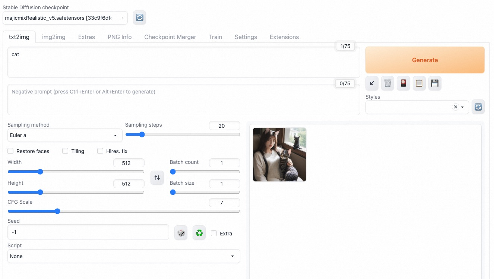

# Stable Diffusion

## QuickStart

### Prerequisites

- An ASK cluster is created. For more information,
  see [Create an ASK cluster](https://www.alibabacloud.com/help/en/ack/serverless-kubernetes/user-guide/create-an-ask-cluster-2?spm=a2c63.p38356.0.0.664265cdTbNZo1#task-e3c-311-ydb)
- The cluster runs as expected. You can log on to the Container Service for Kubernetes (ACK) console, navigate to the
  Clusters page, and then check whether the cluster is in the Running state.

### Deploy Stable Diffusion

1. create deployment & service

```bash
# for cpu
kubectl apply -f stable-diffusion-cpu.yaml
# for gpu
kubectl apply -f stable-diffusion-gpu.yaml
```  

2. wait deployment ready

```bash
$ kubectl get po|grep stable-diffusion
---
NAME                                READY   STATUS              RESTARTS   AGE
stable-diffusion-5469d87d76-fjg9f   1/1     Running             0          2m55s
```  

3. Using Stable Diffusion WebUI

Run the following command to port-forward:

```
kubectl port-forward -n <namespace> service/stable-diffusion-svc 7860:7860
```

And then open the console using the following URL:

```
http://localhost:7860
```



### Deploy Stable Diffusion Dreambooth

1. create deploy & svc

```bash
kubectl apply -f sd-dreambooth.yaml
```

2. wait pod ready

```bash
$ kubectl get po|grep stable-diffusion-train
---
stable-diffusion-train-5469d87d76-fjg9f   1/1     Running             0          2m55s
```

3. Using Stable Diffusion WebUI with dreambooth

Run the following command to port-forward:

```
kubectl port-forward -n <namespace> service/stable-diffusion-train 7860:7860
```

And then open the console using the following URL:

```
http://localhost:7860
```

See the [doc](https://developer.aliyun.com/adc/scenario/6d69e5cb2453472587c35b0a9eb68979) for using Dreambooth to train
your own models.

## Release Tag

| tag        | date    | release                                                   |
|------------|---------|-----------------------------------------------------------|
| v1.4.0     | 2023-12 | model: v1-5-pruned-emaonly.safetensors; WebUI版本:v1.6.0    | 
| v2.0.0-gpu | 2023-12 | model: v1-5-pruned-emaonly.safetensors;support dreambooth |                    |

