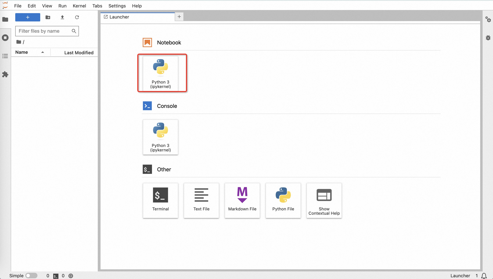

# 通义千问

## Introduction

https://help.aliyun.com/zh/dashscope/developer-reference/api-details

### Prerequisites

1. [开通DashScope并创建API-KEY](https://help.aliyun.com/zh/dashscope/developer-reference/activate-dashscope-and-create-an-api-key?spm=a2c4g.11186623.0.i2)
2. 申请通义千问模型API权限，[点此申请](https://help.aliyun.com/zh/dashscope/support/faq?spm=a2c4g.11186623.0.i23#vuoFh)

### Deploy Jupyter

1. create a Jupyter Notebook Deployment (CPU)

```bash
kubectl apply -f notebook.yaml
```

2. wait deployment ready

```bash
kubectl get po |grep notebook

# NAME                       READY   STATUS    RESTARTS   AGE
# notebook-d68d854c9-ptvtp   1/1     Running   0          8m5s
```

3. connect to the Jupyter Notebook

Run the following command to port-forward:

```
kubectl port-forward -n <namespace> service/notebook-svc 8888:8888
```

And then open the console using the following URL:

```
http://localhost:8888
```

4. 创建Notebook，参考[tongyi.ipynb](tongyi.ipynb)调用通义千问API。


