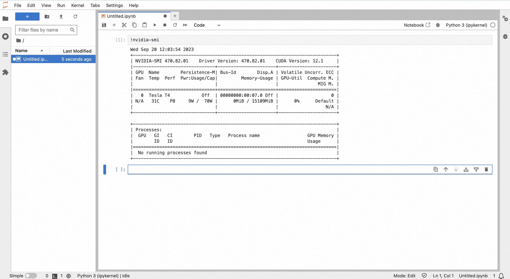

# Jupyter GPU

## QuickStart

### Prerequisites

- An ASK cluster is created. For more information,
  see [Create an ASK cluster](https://www.alibabacloud.com/help/en/ack/serverless-kubernetes/user-guide/create-an-ask-cluster-2?spm=a2c63.p38356.0.0.664265cdTbNZo1#task-e3c-311-ydb)
- The cluster runs as expected. You can log on to the Container Service for Kubernetes (ACK) console, navigate to the
  Clusters page, and then check whether the cluster is in the Running state.

### Deploy Stable Diffusion

1. create jupyter deployment & service
```bash
kubectl apply -f jupyter-gpu.yaml
```  

2. wait deployment ready
```bash
kubectl get po |grep notebook

# NAME                       READY   STATUS    RESTARTS   AGE
# notebook-d68d854c9-ptvtp   1/1     Running   0          8m5s
```
   

3. get ExternalIP
```bash
kubectl get svc notebook-svc --output jsonpath='{.status.loadBalancer.ingress[0].ip}'
```

4. open the returned IP (http://${ExternalIP}:8888) in the web browser
