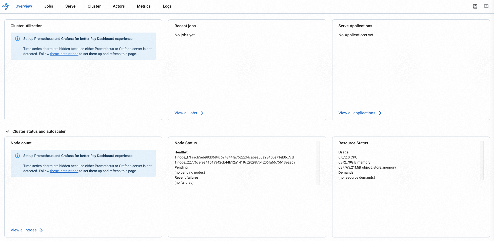

# Kuberay

## QuickStart

### Prerequisites

- An ASK cluster is created. For more information,
  see [Create an ASK cluster](https://www.alibabacloud.com/help/en/ack/serverless-kubernetes/user-guide/create-an-ask-cluster-2?spm=a2c63.p38356.0.0.664265cdTbNZo1#task-e3c-311-ydb)
- The cluster runs as expected. You can log on to the Container Service for Kubernetes (ACK) console, navigate to the
  Clusters page, and then check whether the cluster is in the Running state.
- Make sure the version of Helm is v3+

### Deploy Kuberay Operator
```bash
helm repo add kuberay https://ray-project.github.io/kuberay-helm/
helm repo update

# Install both CRDs and KubeRay operator v1.0.0-rc.0.
helm install kuberay-operator kuberay/kuberay-operator --version 1.0.0-rc.0

# Confirm that the operator is running in the namespace `default`.
kubectl get pods
# NAME                               READY   STATUS    RESTARTS   AGE
# kuberay-operator-f967c4c58-km4cp   1/1     Running   0          49s
```  

### Create Ray Cluster
1. create ray cluster CR
```bash
# Deploy a sample RayCluster CR from the KubeRay Helm chart repo:
helm install raycluster kuberay/ray-cluster --version 1.0.0-rc.0

# Once the RayCluster CR has been created, you can view it by running:
kubectl get rayclusters

# NAME                 DESIRED WORKERS   AVAILABLE WORKERS   STATUS   AGE
# raycluster-kuberay   1                 1                   ready    72s

kubectl get pods -o wide --selector=ray.io/cluster=raycluster-kuberay
# NAME                                          READY   STATUS    RESTARTS   AGE     IP               NODE                            NOMINATED NODE   READINESS GATES
# raycluster-kuberay-head-qclvn                 1/1     Running   0          6m21s   172.26.162.200   virtual-kubelet-cn-hongkong-b   <none>           <none>
# raycluster-kuberay-worker-workergroup-9czcv   1/1     Running   0          6m21s   172.26.162.201   virtual-kubelet-cn-hongkong-b   <none>           <none>

```


2. create ingress
```bash
kubectl create -f head-ingress.yaml

kubectl get ingress
# NAME                          CLASS   HOSTS   ADDRESS        PORTS   AGE
# raycluster-kuberay-head-svc   nginx   *       ${ExternalIP}  80      89s
```

3. open the returned IP (http://${ExternalIP}) in the web browser
   